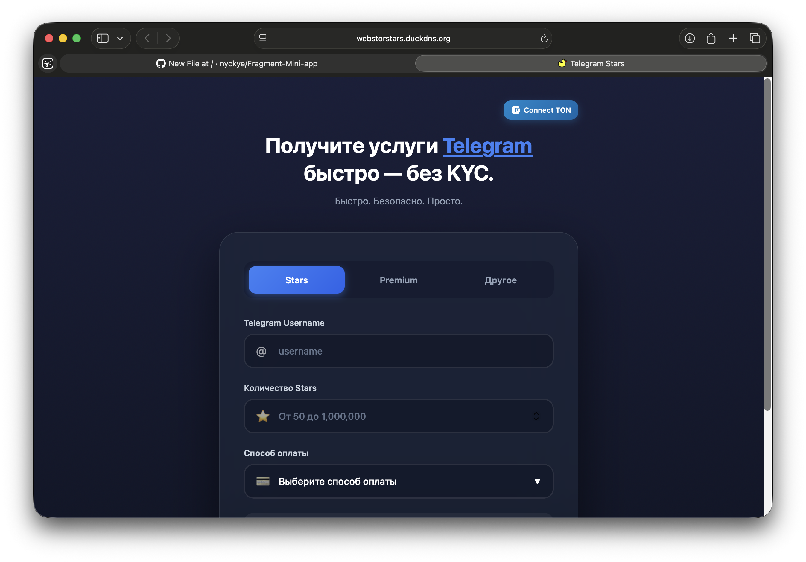

```
███████╗██████╗  █████╗  ██████╗ ███╗   ███╗███████╗███╗   ██╗████████╗
██╔════╝██╔══██╗██╔══██╗██╔════╝ ████╗ ████║██╔════╝████╗  ██║╚══██╔══╝
█████╗  ██████╔╝███████║██║  ███╗██╔████╔██║█████╗  ██╔██╗ ██║   ██║   
██╔══╝  ██╔══██╗██╔══██║██║   ██║██║╚██╔╝██║██╔══╝  ██║╚██╗██║   ██║   
██║     ██║  ██║██║  ██║╚██████╔╝██║ ╚═╝ ██║███████╗██║ ╚████║   ██║   
╚═╝     ╚═╝  ╚═╝╚═╝  ╚═╝ ╚═════╝ ╚═╝     ╚═╝╚══════╝╚═╝  ╚═══╝   ╚═╝   

███╗   ███╗██╗███╗   ██╗██╗      █████╗ ██████╗ ██████╗ 
████╗ ████║██║████╗  ██║██║     ██╔══██╗██╔══██╗██╔══██╗
██╔████╔██║██║██╔██╗ ██║██║     ███████║██████╔╝██████╔╝
██║╚██╔╝██║██║██║╚██╗██║██║     ██╔══██║██╔═══╝ ██╔═══╝ 
██║ ╚═╝ ██║██║██║ ╚████║██║     ██║  ██║██║     ██║     
╚═╝     ╚═╝╚═╝╚═╝  ╚═══╝╚═╝     ╚═╝  ╚═╝╚═╝     ╚═╝
```

# 🌟 Fragment — Backend & Improvements for ScriptCode Team

**Fragment** — это серверная и клиентская часть проекта **WebStorStars**, современного Telegram-магазина для покупки Stars, Premium и других услуг с интеграцией **Telegram Mini App** и **Telegram Bot**.

<p align="center">
  
</p>

## 🧠 О проекте

🌐 **WebStorStars** — это HTML Mini-App и Telegram-бот, работающие вместе.  
Пользователь заходит через Mini-App, выбирает услугу (Stars / Premium / Other), выбирает валюту оплаты (RUB, TON, USDT) и совершает покупку через бота.  
Бэкенд на **FastAPI** соединяет всё воедино: проверяет пользователей через Fragment API, создаёт инвойсы, проверяет оплату и отправляет Stars.

---

## 💻 Компоненты проекта

### 🧩 HTML Mini-App (`index.html`)
Красивая и адаптивная Mini-App с:
- ✅ 3 вкладками — **Stars**, **Premium**, **Other**
- ✅ Проверкой username через **Fragment API**
- ✅ Отображением профиля (аватар, имя, username)
- ✅ Расчётом цены в зависимости от способа оплаты (**RUB / TON / USDT**)
- ✅ Переключением темы (**светлая / тёмная**)
- ✅ Поддержкой двух языков — **RU / EN**
- ✅ Лимитами: от **50** до **1 000 000 Stars**

---

### 🤖 Telegram Bot (`bot.py`)
Бот на **Aiogram**, который:
- ✅ Работает с **SQLite** (пользователи и транзакции)
- ✅ Использует **Fragment API** для проверки username
- ✅ Подключён к **TON Wallet (WalletV5R1)** — для отправки Stars
- ✅ Обрабатывает данные из Mini-App
- ✅ Отправляет уведомления администраторам

---

## 🏗️ Backend (FastAPI)

### 🚀 Эндпоинты

|  Метод |        Эндпоинт        |      Описание      |
|--------|------------------------|------------------------------------|
| `POST` | `/api/check_user` | Проверка username через Fragment API |
| `POST` | `/api/create_invoice` | Создание счёта на оплату |
| `GET`  | `/api/check_payment/{invoice_id}` | Проверка статуса оплаты |
| `POST` | `/api/purchase` | Завершение покупки и отправка Stars |
| `GET`  | `/api/wallet_balance` | Получение баланса кошелька |

---

### ⚙️ Архитектура

- **FastAPI** + **Uvicorn**
- **SQLite / PostgreSQL**
- **SQLAlchemy ORM**
- **.env** (переменные окружения)
- **CORS** для Telegram Mini-App
- **Fragment API** + **TON Wallet API**

---

## 🧾 Пример `.env`

```env
BOT_TOKEN=ваш_токен
API_TON=ваш_api
GROQ_API_KEY=ваш_groq_ключ
MNEMONIC=word1,word2,word3...
STEL_SSID=...
STEL_DT=-240
STEL_TON_TOKEN=...
STEL_TOKEN=...
FRAGMENT_HASH=...
FRAGMENT_PUBLICKEY=...
FRAGMENT_WALLETS=...
FRAGMENT_ADDRES=...
ADMIN_IDS=123456789,987654321
```

### 🧰 Установка и запуск

1. Для начала клонируйте репозиторий и перейдите в папку проекта
```
python -m venv .venv
source .venv/bin/activate   # для Linux / macOS
.\.venv\Scripts\activate    # для Windows
```
2. Установите все зависимости:
```
pip install -r requirements.txt
```

### 🔒 Безопасность
	•	Все ключи и токены — только в .env
	•	Проверка лимитов (50–1 000 000 Stars)
	•	Подтверждение транзакции до отправки Stars
	•	Логирование операций и транзакций


### 🧠 Исправленные ошибки:

🪙 Проблема с балансом TON в HTML
Раньше переменная walletBalance не сохраняла значение, из-за чего проверки не работали.

❌ Было:
```
getWalletBalance(walletAddress).then(balance => {
    walletBalance.textContent = `${balance} TON`;  // ← только в DOM
});
if (walletBalance < price) // ← всегда 0!
```
✅ Исправлено:
```
getWalletBalance(walletAddress).then(balance => {
    walletBalance = balance;  // ← сохраняем в переменную!
    walletBalanceEl.textContent = `${balance} TON`;
});
```

### 🕓 Последнее обновление: 
```
Обновление от 1 ноября 2025 года:
	•	Добавлен новый модуль Fragment-api/api.py
	•	Подготовлен backend на FastAPI с полноценными API-эндпоинтами
	•	Оптимизирована работа с кошельками TON и Fragment API
	•	Добавлена структура проекта с отдельными модулями: config.py, database.py, handlers.py, main.py
	•	Реализована возможность изменения параметров конфигурации через Telegram-бота
	•	Исправлены ошибки в Mini-App (валидация username, сохранение баланса, перевод интерфейса)
	•	Улучшена производительность и безопасность
```
```
Разработка и интеграция: ScriptCode Team.
Архитектура backend и AI-интеграции — ScriptCode Team.
🌍 TG-канал: https://t.me/codescriptteam
```
